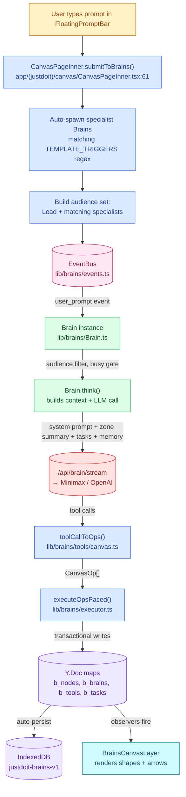
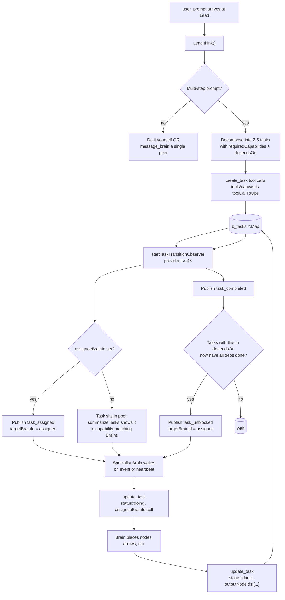
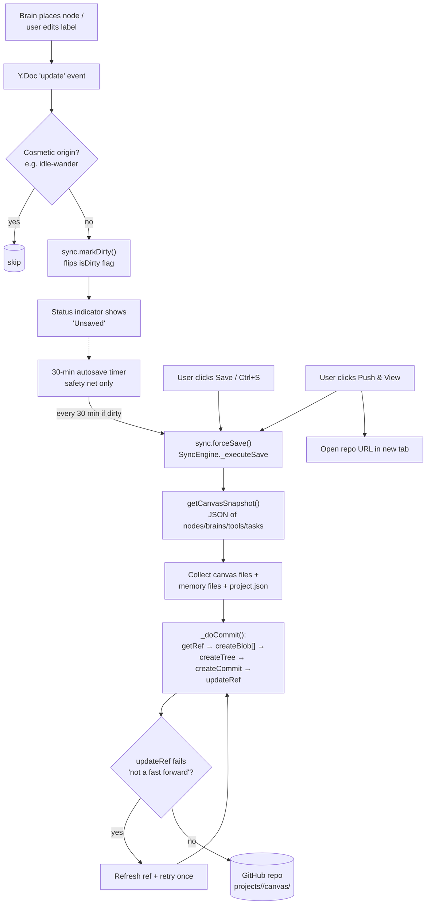
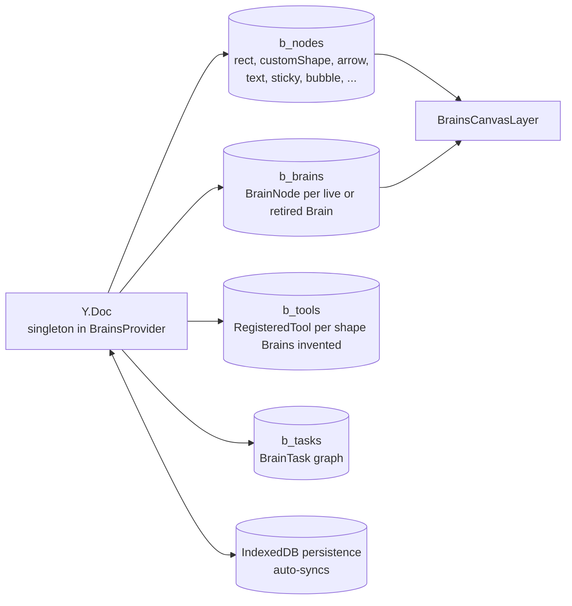
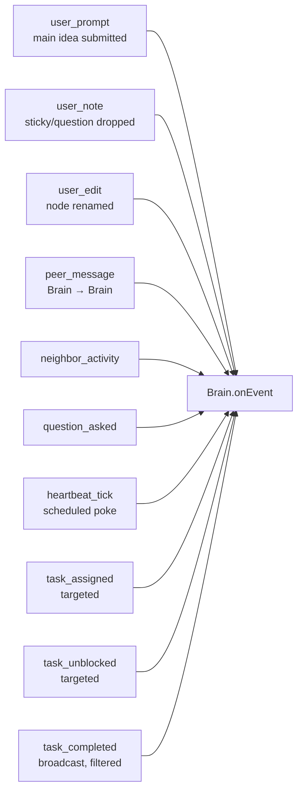
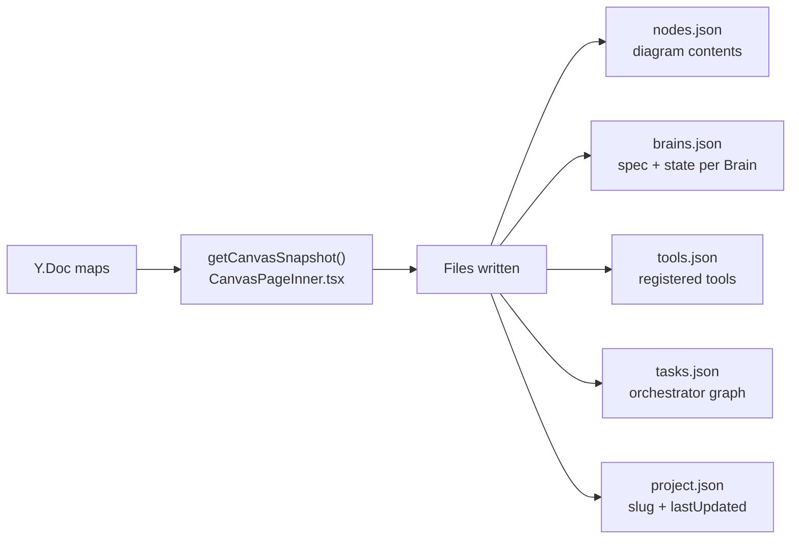
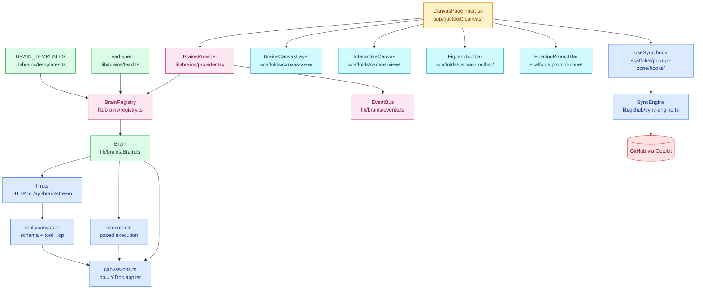

# Canvas mechanism — end-to-end flow

How the autonomous-Brain canvas actually works, from a user typing a prompt to native shapes appearing and the work optionally landing on GitHub.

This is a reference, not a tutorial. Each box names the exact file you should grep when you want to dig in.

---

## 1. High-level: user prompt → diagram on canvas



**The two routing layers**

- **Pre-route (regex):** `submitToBrains` in `CanvasPageInner.tsx:92-99` scans the prompt against `TEMPLATE_TRIGGERS` (`lib/brains/templates.ts:105-113`) and ensures matching specialist Brains exist. The audience is *Lead + every matched specialist*. Brains outside the audience never see the event — saves wasted "decide to be silent" LLM calls.
- **Post-route (LLM):** Once the prompt reaches Lead, Lead decides whether to do the work itself, route to a peer via `message_brain`, or decompose into tasks (orchestrator path — see flow #3).

---

## 2. Per-Brain wake cycle

What happens inside one Brain when it receives an event.

```mermaid
flowchart TD
  EVT[Event arrives via EventBus]
  TGT{Targeted at me?<br/>(peer_message / heartbeat / task_assigned check targetBrainId)}
  AUD{In audience?<br/>(user_prompt only)}
  BUSY{busy?}
  QUEUE[Buffer if user_prompt /<br/>user_edit / user_note;<br/>drop heartbeat]
  LISTEN[setState 'listening']
  THINK[setState 'thinking']
  CTX[Build context:<br/>palace + assessment +<br/>tasks + zone summary]
  LLM[(LLM call<br/>callBrainLLM)]
  CAP{Token cap reached?}
  ERR_BUBBLE[Surface bubble:<br/>'LLM error: ...']
  PARSE[Parse tool calls<br/>→ CanvasOp[]]
  ACTING[setState 'acting']
  PACED[executeOpsPaced<br/>cursor animation, throttled]
  WRITE[Y.Doc transactions<br/>commit ops]
  SIDE[Side-channel: peer_message<br/>→ EventBus]
  STORE[Store turn into MemPalace]
  PARK[Park cursor at zone corner]
  IDLE[setState 'idle' →<br/>busy = false]
  DRAIN{pendingUserEvents<br/>queue empty?}

  EVT --> TGT
  TGT -- "no" --> X[(drop)]
  TGT -- "yes" --> AUD
  AUD -- "out of audience" --> X
  AUD -- "in audience" --> BUSY
  BUSY -- "yes" --> QUEUE --> X2[(return)]
  BUSY -- "no" --> LISTEN
  LISTEN --> THINK
  THINK --> CTX
  CTX --> CAP
  CAP -- "yes" --> ERR_BUBBLE --> WRITE
  CAP -- "no" --> LLM
  LLM --> PARSE
  PARSE --> ACTING
  ACTING --> PACED
  PACED --> WRITE
  PACED --> SIDE
  WRITE --> STORE
  STORE --> PARK
  PARK --> IDLE
  IDLE --> DRAIN
  DRAIN -- "no" --> EVT
  DRAIN -- "yes" --> WAIT[(wait for next event)]
```

**Heartbeat tier (background patrol)**

Every Brain also has a heartbeat ticker (`Brain.scheduleHeartbeat`, `lib/brains/Brain.ts:82`). Default ~3-6 min interval with 0-30s jitter. On tick:

1. Compute a cheap canvas hash (`canvasHash()`).
2. If hash unchanged since last heartbeat → skip the LLM call entirely (saves bulk of ambient tokens).
3. If a global heartbeat is already in flight → skip (one-Brain-at-a-time floor of 25s, prevents thundering herd).
4. Otherwise publish a `heartbeat_tick` event addressed to self. Same `onEvent` flow as above.

This is why your canvas "feels alive" without burning credits when nothing's happening.

---

## 3. Orchestrator path — task decomposition + rhythmic pull

When Lead receives a multi-step prompt, it can decompose into tasks instead of routing prose. Tasks live in the `b_tasks` Y.Map and Brains pull from there in dependency order.



**Why this shape (the rhythmic-wave model)**

Without this layer, every Brain sees every `user_prompt` and decides independently — leading to overlapping work, no ordering, and nothing recording dependencies. With `b_tasks`:

- The DAG is explicit. `Schema design` declares `dependsOn: ['design-architecture']` and won't fire until that one is done.
- New Brains plug in by declaring `capabilities`. The orchestrator finds them automatically — no regex update needed.
- The Kanban view (later) is just `<TaskBoard>` reading `b_tasks` grouped by `status`.

---

## 4. Save / Push lifecycle (manual save + 30-min safety net)



**Why no commit-on-edit**

Earlier the engine had a 5-second debounced save inside `markDirty`, plus a 5-minute interval timer. With Brain idle-wander mutating the Y.Doc every 10s, this turned into a commit every 10-15 seconds — noisy git history, GitHub rate-limit pressure, and constant not-fast-forward races where overlapping saves fought each other. Now `markDirty` only flips a flag; the only paths to GitHub are the Save button, Ctrl+S, the Push button, or the 30-min safety-net timer.

---

## 5. Y.Doc structure (the source of truth)

Everything on the canvas is one of these four maps. Anything not in here doesn't exist.



**Mutation discipline.** Brains never write Y.Doc directly. They emit `CanvasOp[]` and hand them to `applyOps()` (`lib/brains/canvas-ops.ts:26`). One transaction per batch. The op types: `create`, `update`, `delete`, `move_brain_cursor`, `set_brain_state`, `register_tool`, `create_task`, `update_task`, `delete_task`, plus the side-channel `peer_message` (which doesn't touch the Y.Doc — the executor pulls it out and routes via the EventBus).

---

## 6. Event types — what actually wakes a Brain



Subscription happens in `Brain.init()` (`lib/brains/Brain.ts:64`). The `EventFilter` matchers (types/authorNot/zone) cull at the bus level; per-event filtering (`targetBrainId`, audience pre-route, "task_completed only if I have ready tasks") happens at the top of `onEvent`.

---

## 7. The save snapshot — what gets committed

When you click Save, this is what lands in `projects/<projectId>/canvas/` on GitHub:



The Y.Doc binary state itself is **not** committed — JSON-only, fully diffable, round-trips cleanly when the project is reopened on a fresh device (the maps rehydrate from JSON). Yjs CRDT metadata (vector clocks, deletion tombstones) is intentionally dropped; it'd bloat the repo and isn't needed for single-user history.

---

## 8. Tool surface — what Brains can actually do

| Category | Tools | What they produce |
|----------|-------|-------------------|
| Talk | `say`, `move_to` | speech bubble, cursor animation |
| Place primitives | `place_node`, `place_rect`, `place_shape` | native canvas shapes |
| Connect | `draw_arrow` | arrow with optional `bidirectional` |
| Aggregate | `mermaid_diagram`, `chart` (ECharts), `place_network` (d3-force) | one-blob renders or auto-laid-out networks |
| Coordinate | `message_brain`, `spawn_brain`, `register_tool` | peer messaging, dynamic Brain spawn, reusable shape registration |
| Orchestrator | `create_task`, `update_task` | task graph mutations → wake events |

**Two sources of visual quality:**
- `place_node` — built-in primitives in `lib/brains/tools/shapes.ts`, tuned and consistent. The default path.
- `place_shape` — Iconify icon library. **Curated allowlist only** (`tabler`, `lucide`, `phosphor`, `heroicons`, `mdi`, `simple-icons`, `carbon`, `material-symbols`). Everything else 400s at the proxy. Used for distinctive iconography (brand marks, custom hardware).

---

## 9. Component-level wiring (where files plug into each other)



---

## Quick file index

| What | File |
|------|------|
| Canvas page entry | `app/(justdoit)/canvas/CanvasPageInner.tsx` |
| Y.Doc + EventBus singletons | `lib/brains/provider.tsx` |
| Brain runtime | `lib/brains/Brain.ts` |
| Brain registry | `lib/brains/registry.ts` |
| Lead Brain spec + prompt | `lib/brains/lead.ts` |
| Peer Brain templates + ROLE_PREFIX | `lib/brains/templates.ts` |
| Y.Doc op applier + helpers | `lib/brains/canvas-ops.ts` |
| Type definitions | `lib/brains/types.ts` |
| LLM tool schemas + tool→op | `lib/brains/tools/canvas.ts` |
| Built-in node primitives | `lib/brains/tools/shapes.ts` |
| Mermaid renderer | `lib/brains/tools/renderers/mermaid.ts` |
| ECharts renderer | `lib/brains/tools/renderers/echarts.ts` |
| Pacing / cursor animation | `lib/brains/executor.ts` |
| LLM transport | `lib/brains/llm.ts` |
| Stream API route | `app/api/brain/stream/route.ts` |
| Icon proxy + allowlist | `app/api/brain/icon/route.ts` |
| Save/Push wiring (UI) | `scaffolds/prompt-zone/hooks/useSync.ts` |
| Save/Push engine | `lib/github/sync-engine.ts` |
| GitHub auth (PAT) | `lib/github/auth.ts` |
| Canvas render (Brain layer) | `scaffolds/canvas-view/BrainsCanvasLayer.tsx` |
| Canvas render (legacy) | `scaffolds/canvas-view/InteractiveCanvas.tsx` |

---

*Generated for the canvas mechanism walkthrough. If any flow above doesn't match what you observe in the running app, the code is the source of truth — re-grep the cited files and update the doc.*
