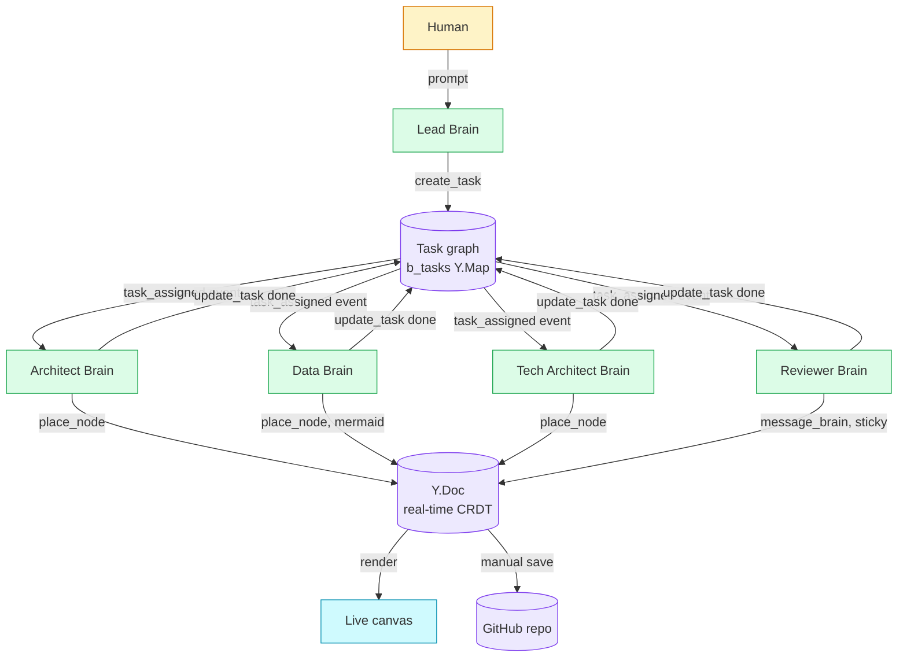

<div align="center">

# justdoit

### **A virtual office for diagrams.**
### Visible AI teammates that *build* the diagram with you, not for you.

[](https://github.com/unc-asahay/justdoit)
[](LICENSE)
[](#architecture)

---

</div>

## The product in one line

A canvas where multiple autonomous AI Brains — each with its own persona, capabilities, and on-screen zone — visibly collaborate to design software architectures, schemas, user flows, and system diagrams in real time, alongside the human.

## Why this matters

Every "AI diagramming" tool today does the same thing: you type a prompt, it dumps a finished diagram. One LLM call, one artifact, one black box. The user learned nothing. If the diagram is wrong, they re-prompt and pray.

**justdoit inverts that.** A team of AI Brains physically build the diagram on a shared canvas — cursors fly between zones, status pills show who's thinking, work happens step-by-step in front of you. You watch the system reason. You jump in to redirect. You drag, edit, override at any time. It's the difference between getting a slide deck and being in the room when it's drawn.

## What this looks like in practice

You type:

> *"Design a SaaS expense-tracking app — architecture, data model, deploy stack, and what could go wrong."*

The **Lead Brain** decomposes that into 4 tasks with a dependency graph. The **Architect Brain** picks up `system-architecture` and starts placing API gateways, services, and queues in its zone. The **Data Brain** watches Architect's tile, waits for the architecture task to complete, then opens an ER diagram in its own tile. The **Tech Architect Brain** picks `ci-cd` and sketches the deploy topology with concrete AWS services. The **Reviewer Brain** roams the entire canvas, drops critical sticky notes near things that look brittle. The **Plotter Brain** notices two services overlap and messages the Architect to nudge them apart.

You see all of this happen. You can drag any node. You can edit any label. You can drop a sticky asking a question — Brains answer with overlapping speech bubbles. You hit Save and the entire canvas — every node, every Brain's state, every task — versions itself to GitHub.

## How it's different

|  | Lucidchart / Miro | FigJam / Excalidraw | Eraser AI / Whimsical AI | Mermaid Chart | **justdoit** |
|---|---|---|---|---|---|
| Multiplayer canvas | ✓ | ✓ | partial | — | ✓ |
| AI generation | bolt-on | bolt-on | core | core | core |
| Multiple AI agents | — | — | — | — | **✓ — distinct personas, distinct LLM contexts** |
| AI work is visible (staged, not dumped) | — | — | — | — | **✓ — cursors, zones, status pills** |
| Native canvas primitives (every shape editable) | ✓ | ✓ | partial | — (text only) | ✓ |
| Real task DAG between agents | — | — | — | — | **✓ — capability-matched, dependency-gated** |
| Capability-based agent routing | — | — | — | — | **✓** |
| Force-directed network layout | — | — | — | partial | ✓ |
| Bidirectional / multi-end arrows | ✓ | ✓ | — | ✓ | ✓ |
| Versioned via git | — | — | — | — | **✓ — every save is a commit** |
| Self-extending tool palette (agents register new shapes) | — | — | — | — | **✓** |
| Open source | — | partial | — | — | ✓ |

The bold rows are where we have no real competitor.

## The wedge

Three things together that nobody else combines:

1. **Multi-agent, not single-LLM.** Each Brain has its own persona, system prompt, model, and conversation. A 5-Brain canvas is 5 independent LLM contexts — Architect doesn't see Data Brain's reasoning, but they coordinate via the canvas itself, exactly like humans in a war room. This unlocks specialist depth that a single-prompt tool can't reach.

2. **Visible work as the product.** The unique IP isn't the diagrams — it's the *experience of watching the diagram emerge*. Status pills, cursor animation, peer-message ghost arrows, pacing throttles. The user is in the room, not waiting for the artifact. Knowledge transfer happens implicitly.

3. **Orchestrator-grade task graph.** A real `b_tasks` Y.Doc map with `requiredCapabilities`, `dependsOn`, `assigneeBrainId`. Lead decomposes prompts into tasks; peers claim by capability match; tasks unblock when dependencies complete. This is the same pattern as CrewAI / LangGraph but applied to a visual medium where every task has a spatial home on a canvas.

## Market timing — why now

- **AI agents crossed the production threshold in 2025.** CrewAI, AutoGen, LangGraph, OpenAI's Swarm — orchestration is no longer research. The pattern is proven. We're applying it where it's most legible: on a canvas.
- **Diagramming-as-thinking is the fastest-growing knowledge-work primitive.** Excalidraw's growth, Whimsical's enterprise traction, FigJam's trajectory inside Figma all signal the same: visual collaboration is replacing slide decks for the way distributed teams actually think.
- **Software architecture is still drawn on whiteboards.** Despite a $5B+ enterprise diagramming market, the most consequential diagrams — the ones that determine how systems are built — are still photographed off office walls and lost. There's a wedge for "the place where the architecture conversation actually happens."
- **AI assistants stopped being good enough as a single thing.** Every shipping product now needs more than ChatGPT-in-a-box. The next layer is teams of AI specialists with explicit handoffs. The canvas is the most natural surface for that, because handoffs become spatial.

## Architecture



For the full mechanism, see [`CANVAS-MECHANISM.md`](./CANVAS-MECHANISM.md) — 9 mermaid diagrams covering every flow end-to-end.

### Tech stack

| Layer | Choice | Why |
|---|---|---|
| Frontend | Next.js 15 (App Router) + React 19 | Modern primitives, edge-ready |
| Canvas state | Yjs CRDT + IndexedDB persistence | True multiplayer, offline-first, server-optional |
| Render | SVG-native (no canvas tag) | Every shape is independently editable, accessible, scriptable |
| Layout | d3-force, Mermaid, Apache ECharts | Best-in-class for force, structural, and quantitative diagrams |
| LLM transport | Model-agnostic via Bifrost proxy | Swap providers without touching app code |
| Agents | Per-Brain isolated LLM contexts + tool calling | True specialist depth |
| Versioning | Git via Octokit, JSON snapshots | Diagrams diff like code |

## What's shipped (alpha, public)

- 7 specialist Brain templates (Architect, Tech Architect, Designer, Data, Reviewer, Plotter, Mindmap) + dynamic peer spawning
- Lead Brain orchestrator with capability-based task routing
- Y.Doc-backed canvas with native primitives, four-cardinal connection points, bidirectional arrows
- Force-directed network layout (`place_network` tool)
- Curated icon library (8 high-quality Iconify sets, allowlisted)
- ECharts for quantitative, Mermaid for sequence/ER/state diagrams
- Manual save + 30-min safety-net autosave to GitHub
- Self-extending tools: Brains can author and register new SVG shapes
- Real-time peer messaging between Brains (visible ghost arrows)
- Idle wander animation (Tamagotchi-style — canvas feels alive)
- MemPalace per-project memory so Brains build on prior context

## What's next

**Q2** — Kanban view of `b_tasks` (already in the data model, just needs a `<TaskBoard>`). Persistent multiplayer signaling server. New Brain personas: Product (PRD generation), DevOps (CI/CD), Security (STRIDE threat models), QA (test strategy).

**Q3** — Web-fetch tools so Brains can pull live API specs, npm metadata, icons. Real budget governor with per-Brain token caps. Federated Brains across canvas instances. Browser-side D3 layouts for hierarchies and Sankeys.

**Q4** — Enterprise: SSO, audit logs, on-prem self-hosted Bifrost, federated identity. SOC2 readiness. Stripe billing.

## Running locally

```bash
# Both Next.js dev server + the LLM proxy
npm install
npm run dev:full
```

Open http://localhost:3333. Connect a GitHub PAT (Settings → AI), pick a model in Bifrost (Minimax / OpenAI / Anthropic-compatible), drop into `/canvas?project=<slug>`, type a prompt.

## Status

Alpha. Single-developer focus, multiplayer signaling not yet wired. Open source under Apache 2.0. Architecture is stable; UI surface is iterating fast. The core abstractions — Y.Doc as source of truth, capability-matched task graph, visible Brain choreography — are the bet.

## Contact

For investor / partnership conversations: **unrivalednetworkcorp@gmail.com**

For technical / contribution questions: open an issue or PR on this repo.

---

<div align="center">

*Built in the open. The canvas is the war room.*

</div>
